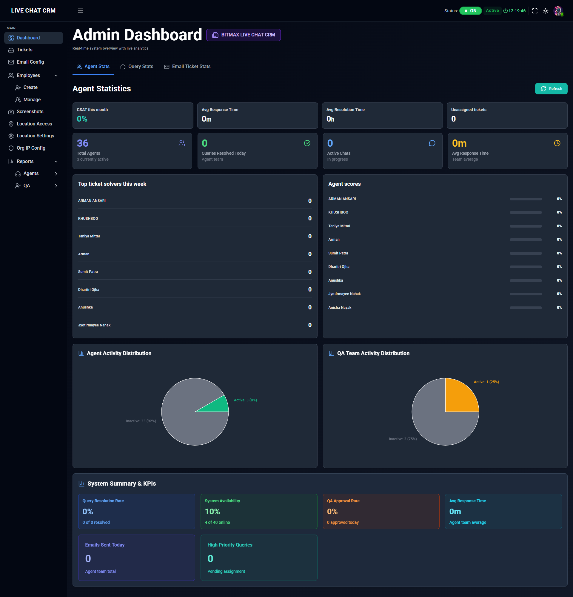
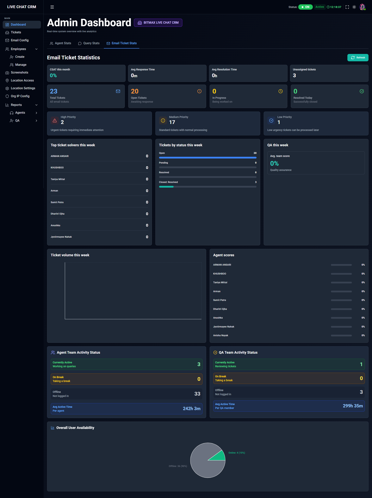
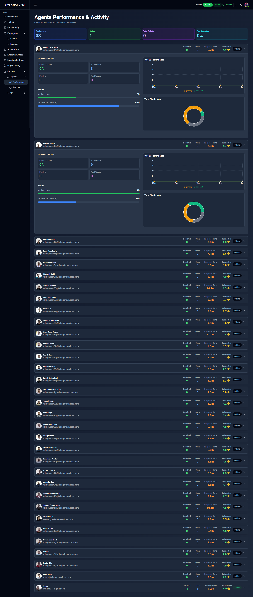
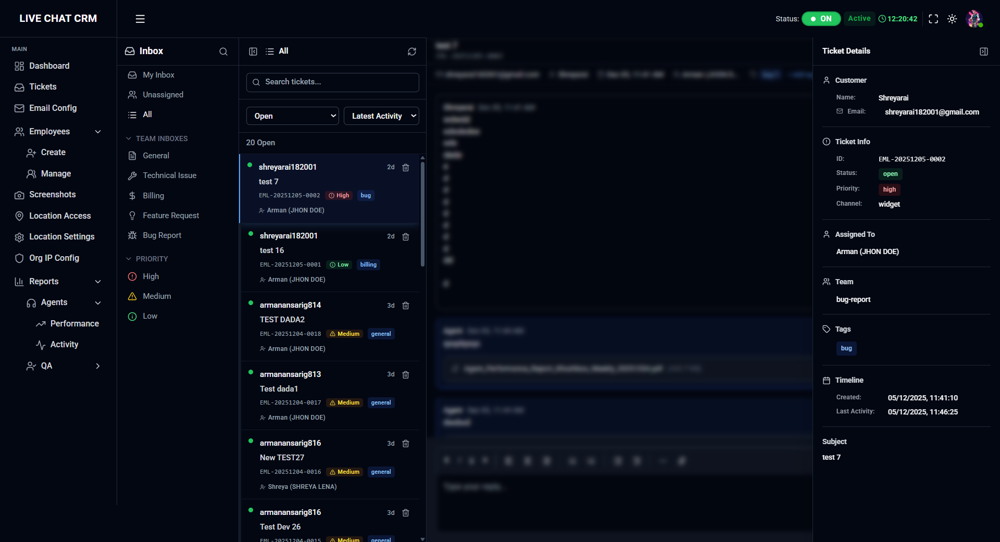
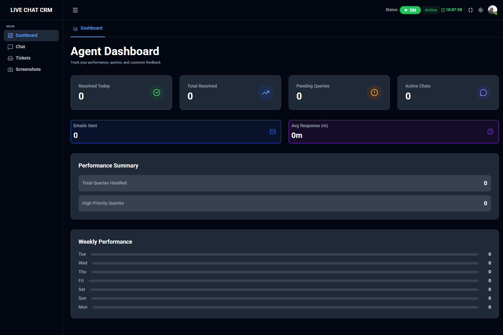

# 🚀 CHAT-CRM Frontend

<div align="center">


**A Modern Multi-Tenant Customer Relationship Management System**

[](https://reactjs.org/)
[](https://vitejs.dev/)
[](https://redux-toolkit.js.org/)
[](https://tailwindcss.com/)
[](LICENSE)

[Features](#-features) • [Tech Stack](#-tech-stack) • [Installation](#-installation) • [Usage](#-usage) • [Screenshots](#-screenshots)

</div>

---

## 📋 Table of Contents

- [About](#-about)
- [Screenshots](#-screenshots)
- [Key Features](#-key-features)
- [Tech Stack](#-tech-stack)
- [System Architecture](#-system-architecture)
- [Installation](#-installation)
- [Configuration](#-configuration)
- [Usage](#-usage)
- [User Roles](#-user-roles)
- [Contributing](#-contributing)
- [License](#-license)

---

## 🎯 About

**CHAT-CRM** is a comprehensive, enterprise-grade Customer Relationship Management platform designed for modern businesses. Built with React and powered by real-time communication technologies, it provides seamless customer engagement through multiple channels including live chat, email ticketing, video/audio calls, and query management.

### What Makes CHAT-CRM Special?

- **🏢 Multi-Tenant Architecture**: Complete isolation between organizations with dedicated databases and configurations
- **🔐 Advanced Security**: Role-based access control, IP-based restrictions, and location-based login enforcement
- **📍 Location Access Control**: Enable/disable location-based login restrictions per organization
- **💬 Real-Time Communication**: WebSocket-powered instant messaging and notifications
- **📧 Email Ticketing**: Integrated IMAP/SMTP email support with automated ticket creation
- **📊 Comprehensive Analytics**: Real-time dashboards for agents, QA teams, and management
- **🎥 Video/Audio Calls**: Built-in WebRTC support for customer support calls
- **📸 Screenshot Monitoring**: Automated screenshot capture for compliance and quality assurance
- **🌐 IP Whitelisting**: Restrict access based on IP addresses for enhanced security
- **🎨 Dark Mode Support**: Beautiful UI with light and dark themes


---

## 📸 Screenshots

### Dashboard Overview

*Real-time metrics and performance analytics at a glance*

### Tickets Stats

*Comprehensive query tracking with status, priority, and assignment*

### Agents Performance & Activity 

*Real-time messaging with typing indicators and file sharing*

### Ticketign System

*Admin control panel for location-based access enforcement*

### Agent Workspace

*Unified interface for agents to manage queries and customer interactions*

### Mutli-Tenent Architecture

*WebRTC-powered video/audio calls with screen sharing*

---


## ✨ Key Features

### 🔒 Security & Access Control

- **Multi-Factor Authentication**: Email/Employee ID login with password
- **IP-Based Access Control**: Organization-level IP whitelisting
- **Location-Based Login**: GPS-based access restrictions for on-premise work
- **Role-Based Permissions**: Granular access control (SuperAdmin, Admin, Agent, QA, TL, Customer)
- **Session Management**: JWT-based secure authentication

### 💬 Communication Channels

- **Live Chat**: Real-time customer support with typing indicators and read receipts
- **Email Ticketing**: Automated ticket creation from incoming emails
- **Video Calls**: WebRTC-powered video conferencing
- **Audio Calls**: High-quality voice communication
- **Query Management**: Structured customer inquiry handling

### 📊 Management & Analytics

- **Admin Dashboard**: Organization overview with key metrics
- **Agent Performance**: Track response times, resolution rates, and customer satisfaction
- **QA Evaluation**: Quality assurance tools with weightage-based scoring
- **Team Performance**: TL dashboard for team monitoring and escalations
- **Screenshot Gallery**: Automated activity monitoring

### 🎛️ Admin Features

- **Employee Management**: Create, edit, and manage staff accounts
- **Location Access Settings**: Enable/disable GPS-based login restrictions
- **Email Configuration**: IMAP/SMTP setup for email ticketing
- **IP Configuration**: Whitelist approved IP addresses
- **Escalation Hierarchy**: Define team structures and escalation paths

### 👤 Agent Features

- **Unified Inbox**: Manage chats, emails, and tickets from one interface
- **Quick Replies & FAQs**: Pre-configured responses for common queries
- **Customer History**: Complete interaction history and notes
- **File Sharing**: Share documents and images with customers
- **Status Management**: Available, Busy, Away status indicators


---

## 🛠️ Tech Stack

### Frontend Core

- **React 18.x**: Modern UI library with hooks and concurrent features
- **Vite 5.x**: Lightning-fast build tool and dev server
- **React Router 6**: Client-side routing with nested routes
- **Redux Toolkit**: State management with RTK Query for API calls

### UI & Styling

- **TailwindCSS 3**: Utility-first CSS framework
- **Framer Motion**: Smooth animations and transitions
- **Lucide React**: Beautiful icon library
- **React Toastify**: Toast notifications
- **React Loading Indicators**: Loading states and spinners

### Real-Time & Communication

- **Socket.io Client**: WebSocket-based real-time communication
- **WebRTC**: Peer-to-peer video/audio calls
- **Axios**: HTTP client for REST API calls

### Forms & Validation

- **Formik**: Form state management
- **Yup**: Schema validation
- **React Hook Form**: Performance-optimized forms

### Additional Libraries

- **Day.js**: Date manipulation and formatting
- **React Webcam**: Webcam capture for screenshots
- **Emoji Picker React**: Emoji support in chat
- **React Markdown**: Markdown rendering support


---

## 🏗️ System Architecture

```
┌─────────────────────────────────────────────────────────────┐
│                     CHAT-CRM Frontend                       │
├─────────────────────────────────────────────────────────────┤
│                                                             │
│  ┌──────────────────────────────────────────────────────┐  │
│  │           React 18 + Vite Application               │  │
│  └──────────────────────────────────────────────────────┘  │
│                          ↓                                  │
│  ┌──────────────────────────────────────────────────────┐  │
│  │         Redux Toolkit (State Management)            │  │
│  │  • RTK Query (API Layer)                           │  │
│  │  • Redux Persist (Local Storage)                   │  │
│  └──────────────────────────────────────────────────────┘  │
│                          ↓                                  │
│  ┌──────────────────────────────────────────────────────┐  │
│  │              Real-Time Layer                         │  │
│  │  • Socket.io (Chat, Notifications)                  │  │
│  │  • WebRTC (Video/Audio Calls)                       │  │
│  └──────────────────────────────────────────────────────┘  │
│                          ↓                                  │
│  ┌──────────────────────────────────────────────────────┐  │
│  │              Backend APIs                            │  │
│  │  • REST API (CRUD Operations)                       │  │
│  │  • WebSocket Server (Real-Time Events)             │  │
│  │  • MongoDB (Data Storage)                           │  │
│  └──────────────────────────────────────────────────────┘  │
│                                                             │
└─────────────────────────────────────────────────────────────┘
```

### Key Components Structure

```
src/
├── apps/               # Redux store configuration
├── components/         # Reusable UI components
│   ├── common/        # Shared components (Sidebar, Header, etc.)
│   ├── superadmin/    # SuperAdmin specific components
│   └── ...
├── context/           # React Context providers
├── features/          # Redux slices and RTK Query APIs
│   ├── auth/          # Authentication
│   ├── chat/          # Chat functionality
│   ├── admin/         # Admin features
│   ├── query/         # Query management
│   ├── faq/           # FAQs and Quick Replies
│   └── ...
├── pages/             # Page components
│   ├── public/        # Login, Register
│   ├── private/       # Protected routes
│   │   ├── admin/     # Admin pages
│   │   ├── agent/     # Agent pages
│   │   ├── qa/        # QA pages
│   │   ├── tl/        # Team Lead pages
│   │   └── customer/  # Customer pages
│   └── superadmin/    # SuperAdmin pages
├── routes/            # Route configuration
├── socket/            # Socket.io setup
├── utils/             # Utility functions
└── main.jsx           # Application entry point
```

---

## 📦 Installation

### Prerequisites

- **Node.js**: v18.x or higher
- **npm**: v9.x or higher (or yarn/pnpm)
- **Git**: For version control

### Quick Start

1. **Clone the repository**

```bash
git clone https://github.com/ARMANANS1218/CHAT-CRM-FRONTEND.git
cd CHAT-CRM-FRONTEND
```

2. **Install dependencies**

```bash
npm install
```

3. **Set up environment variables**

Create a `.env` file in the root directory:

```env
# API Configuration
VITE_API_URL=http://localhost:5000
VITE_SOCKET_URL=http://localhost:5000

# Google Maps API (for location features)
VITE_GOOGLE_MAPS_KEY=your_google_maps_api_key

# Optional: Analytics, Error Tracking
VITE_ANALYTICS_ID=your_analytics_id
```

4. **Start the development server**

```bash
npm run dev
```

The application will be available at `http://localhost:5173`

5. **Build for production**

```bash
npm run build
```

Production files will be in the `dist/` directory.

---

## ⚙️ Configuration

### Environment Variables

| Variable | Description | Default | Required |
|----------|-------------|---------|----------|
| `VITE_API_URL` | Backend API base URL | `http://localhost:5000` | Yes |
| `VITE_SOCKET_URL` | WebSocket server URL | `http://localhost:5000` | Yes |
| `VITE_GOOGLE_MAPS_KEY` | Google Maps API key for location features | - | For location features |

### Vite Configuration

The project uses Vite for blazing-fast development. Key configurations:

- **Hot Module Replacement (HMR)**: Instant updates without full reload
- **Code Splitting**: Automatic chunking for optimal loading
- **Tree Shaking**: Remove unused code in production
- **CSS Optimization**: Automatic minification and purging

### TailwindCSS Configuration

Custom theme configuration in `tailwind.config.js`:

```javascript
theme: {
  extend: {
    colors: {
      primary: {...},
      secondary: {...}
    },
    animation: {
      'fade-in': 'fadeIn 0.3s ease-in',
      'slide-up': 'slideUp 0.3s ease-out'
    }
  }
}
```

---

## 🚀 Usage

### Default Login Credential

**SuperAdmin:**
- Email: `superadmin@chatcrm.com`
- Password: `SuperAdmin@123`

**Admin (Organization-specific):**
- Created by SuperAdmin or during organization setup
- Email format: `admin@yourorganization.com`

**Employees (Agent/QA/TL):**
- Created by Admin
- Login with Employee ID or Email

**Customers:**
- Self-registration or created by agents
- Email-based login

### Running the Application

1. **Development Mode** (with hot reload)
```bash
npm run dev
```

2. **Production Build**
```bash
npm run build
npm run preview  # Preview production build locally
```

3. **Linting**
```bash
npm run lint
```


---

## 👥 User Roles

### 🔵 SuperAdmin
- Manage multiple organizations
- Create and configure organizations
- View system-wide analytics
- Manage location access settings for all organizations
- Approve organization location requests

### 🟢 Admin
- Manage organization settings
- Create and manage employees (Agents, QA, TL)
- Configure email ticketing
- Set up IP whitelisting
- Enable/disable location-based login
- View organization analytics

### 🟡 Team Lead (TL)
- Monitor team performance
- Assign queries to agents
- Handle escalations
- Evaluate agent performance
- Create FAQs and Quick Replies
- Access team analytics

### 🟠 Quality Assurance (QA)
- Evaluate chat quality
- Rate agent performance with weighted scoring
- Create and manage FAQs
- Monitor compliance
- Access evaluation reports

### 🔴 Agent
- Handle customer chats and queries
- Manage email tickets
- Make video/audio calls
- Use Quick Replies and FAQs
- Track personal performance metrics
- Update customer information

### 🟣 Customer
- Initiate chat sessions
- Submit queries
- View interaction history
- Receive support via multiple channels

---

## 🔐 Security Features

- **JWT Authentication**: Secure token-based authentication
- **Role-Based Access Control (RBAC)**: Granular permissions per role
- **IP Whitelisting**: Restrict access to approved IP addresses
- **Location-Based Login**: GPS verification for on-premise access
- **Session Management**: Automatic logout on inactivity
- **HTTPS Enforcement**: Secure data transmission
- **XSS Protection**: Sanitized inputs and outputs
- **CSRF Protection**: Token-based request validation
- **Rate Limiting**: Prevent abuse and DDoS attacks

---

## 🔄 API Integration

### REST API Endpoints

The frontend communicates with the backend via RESTful APIs:

- **Authentication**: `/api/v1/user/login`, `/api/v1/user/register`
- **Queries**: `/api/v1/query/*`
- **Tickets**: `/api/v1/tickets/*`
- **Dashboard**: `/api/v1/dashboard/*`
- **Admin**: `/api/v1/admin/*`
- **SuperAdmin**: `/api/v1/superadmin/*`
- **Location**: `/api/v1/location/*`
- **FAQs**: `/api/v1/faq/*`

### WebSocket Events

Real-time events via Socket.io:

- `new-message`: New chat message received
- `typing`: User typing indicator
- `user-online`: User online status
- `notification`: System notifications
- `query-assigned`: Query assignment notification
- `call-incoming`: Incoming video/audio call

---

## 🤝 Contributing

We welcome contributions! Please follow these steps:

1. **Fork the repository**
2. **Create a feature branch**: `git checkout -b feature/amazing-feature`
3. **Commit your changes**: `git commit -m 'Add amazing feature'`
4. **Push to the branch**: `git push origin feature/amazing-feature`
5. **Open a Pull Request**

### Code Style Guidelines

- Follow ESLint rules
- Use functional components with hooks
- Write meaningful commit messages
- Add comments for complex logic
- Update documentation for new features

---

## 📝 License

This project is licensed under the **MIT License** - see the [LICENSE](LICENSE) file for details.

---


## 📞 Support

For support and queries:

- **Email**: support@chatcrm.com
- **Documentation**: [docs.chatcrm.com](https://docs.chatcrm.com)
- **Issues**: [GitHub Issues](https://github.com/ARMANANS1218/CHAT-CRM-FRONTEND/issues)

---

## 🙏 Acknowledgments

- React Team for the amazing framework
- Vite Team for the blazing-fast build tool
- TailwindCSS for the utility-first CSS framework
- Socket.io for real-time communication
- All open-source contributors

---

<div align="center">

**Made with ❤️ by the CHAT-CRM Team**

⭐ Star us on GitHub if you find this project helpful!

[Website](https://chatcrm.com) • [Documentation](https://docs.chatcrm.com) • [Twitter](https://twitter.com/chatcrm)

</div>
